# Part 2 chart gallery

All eleven charts use the same 24.7 million-loan comparison. The first four make the result
visible in loan and default counts; the remaining charts test whether it survives different cuts
of the data. See the [README](README.md) for the short version or the [extended report](REPORT.md)
for methods and exact tables.

## The result without statistical shorthand

### 1. Which score finds more of the future defaults first?

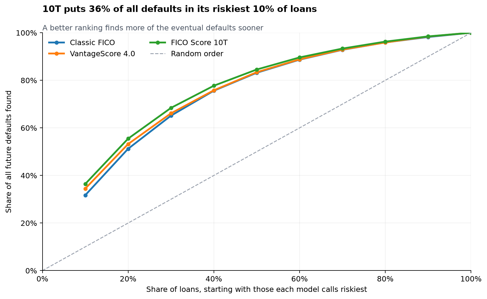

**What it shows:** Start with the loans each score calls riskiest, then move down the list. The
line records how many of the sample's future defaults have been found.

**What to notice:** In equally large riskiest-10% groups, 10T finds 104,879 defaults, VantageScore
finds 99,241, and Classic FICO finds 91,279. A random list would follow the dashed diagonal.

### 2. Which score builds the safer same-size portfolio?

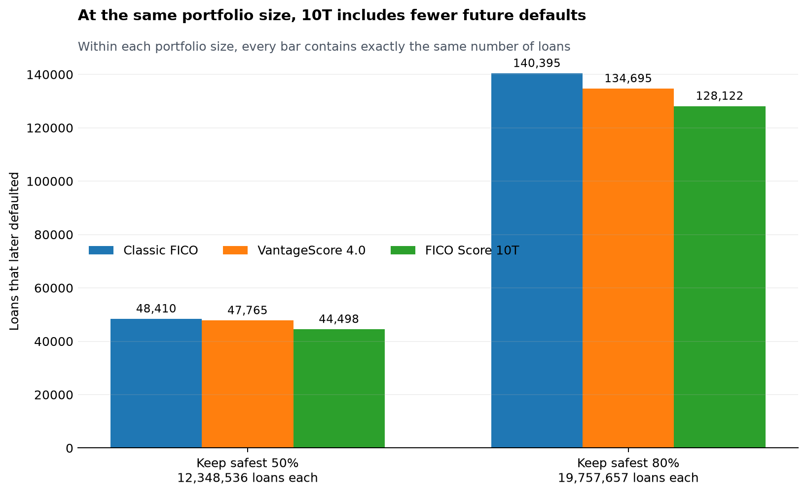

**What it shows:** Keep the safest 50% or 80% under each score. Every bar at a given portfolio
size contains exactly the same number of loans.

**What to notice:** Lower is better, and 10T is lowest at both sizes. In the safest-80% portfolio,
10T includes 128,122 future defaults, versus 134,695 under VantageScore and 140,395 under Classic.

### 3. What happens when the modern models disagree?

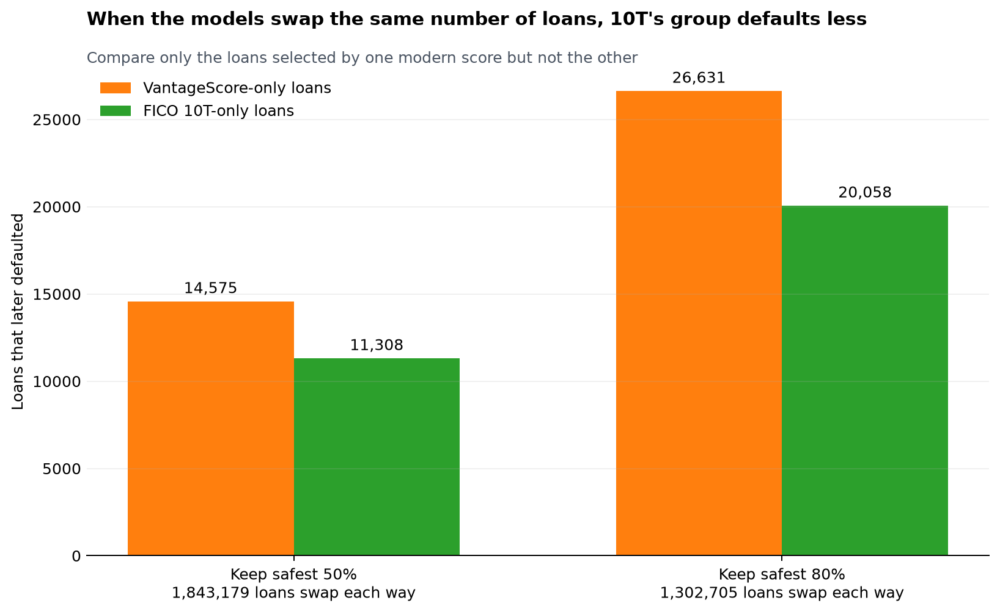

**What it shows:** Compare only the loans included by VantageScore but not 10T with the same
number included by 10T but not VantageScore.

**What to notice:** At the 80% portfolio size, 1,302,705 loans swap each way. The VantageScore-only
group contains 26,631 future defaults; the 10T-only group contains 20,058. That is 6,573 fewer
without changing the number of loans.

### 4. How does risk change from one end of the list to the other?

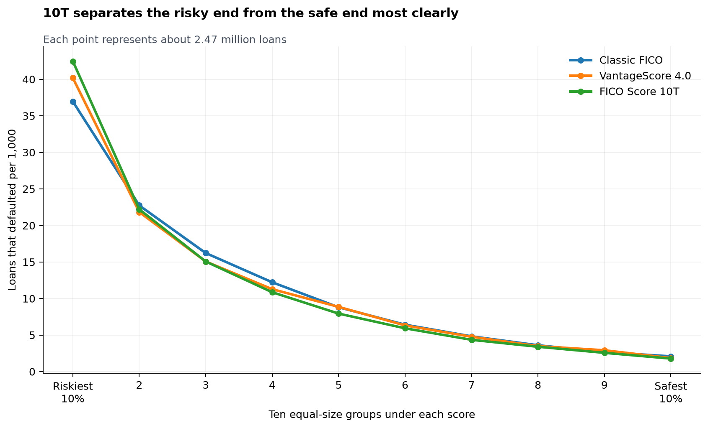

**What it shows:** Each ranking is split into ten groups of about 2.47 million loans. The chart
counts future defaults per 1,000 loans in each group.

**What to notice:** 10T has the most defaults at the end it calls riskiest and the fewest at the
end it calls safest. That wider spread is what a sharper risk ranking should produce.

## Checks on the conclusion

### 5. Does the winner change from quarter to quarter?

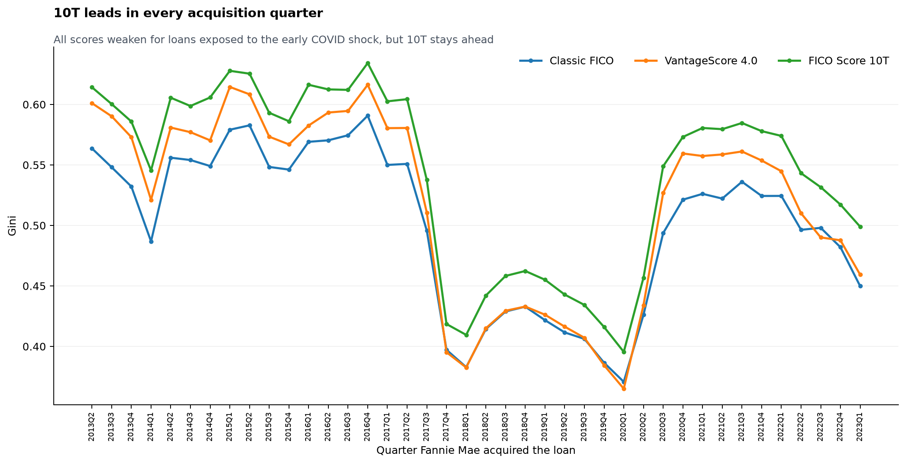

**What it shows:** The ranking test repeated for each quarter in which Fannie Mae acquired the
loans.

**What to notice:** The green 10T line stays above both alternatives in all 40 quarters. All three
scores have a harder time with loans exposed to the early COVID shock, but their order does not
change.

### 6. How large is 10T's lead each quarter?

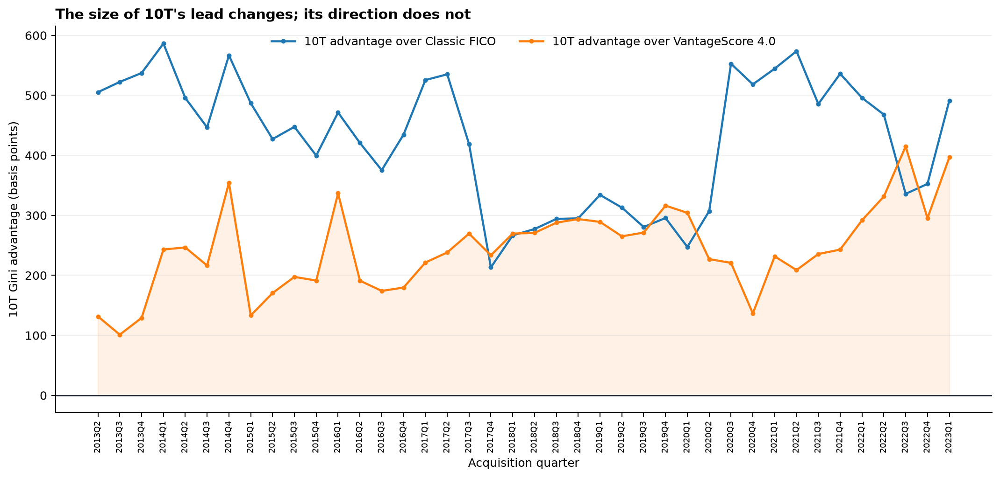

**What it shows:** The previous chart with the common movement removed. A point above zero means
10T ranked that quarter better than the comparison score.

**What to notice:** Every point is above zero. The size of 10T's lead changes, but its direction
does not.

### 7. Does a second borrower change the winner?

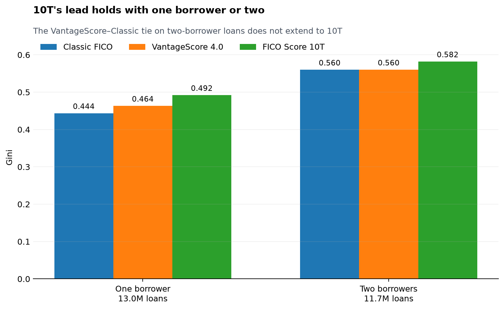

**What it shows:** The three-way comparison separately for loans with one borrower and two.

**What to notice:** FICO 10T leads in both groups. VantageScore and Classic are nearly tied for
two-borrower loans, repeating Part 1, but 10T still moves ahead.

### 8. Is the model-swap result limited to two portfolio sizes?

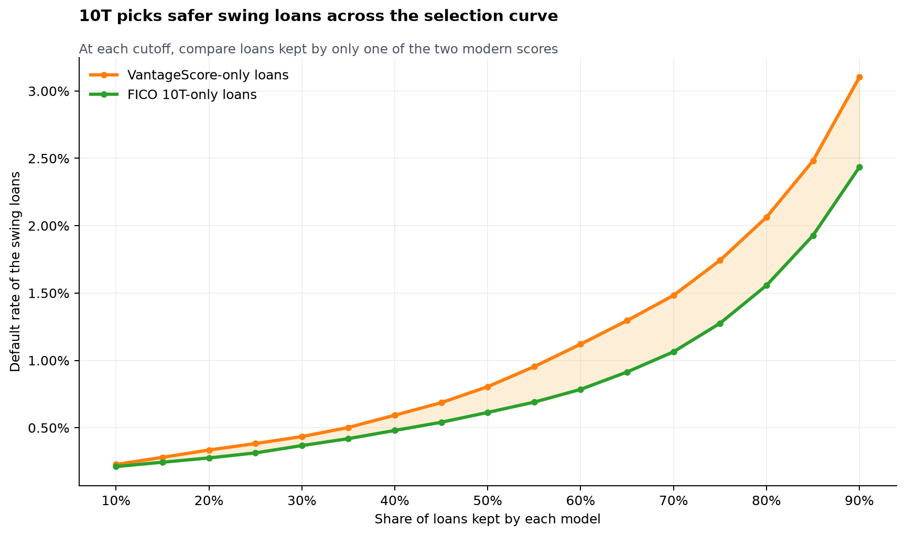

**What it shows:** The modern-model disagreement test repeated from keeping the safest 10% through
90% of the observed loans.

**What to notice:** The 10T-only group has the lower observed default rate at every tested size.
This tie-inclusive view allows the exact number of loans to vary slightly around integer-score
cutoffs; Chart 3 holds the counts exactly equal.

### 9. What are the default rates in the swapped groups?

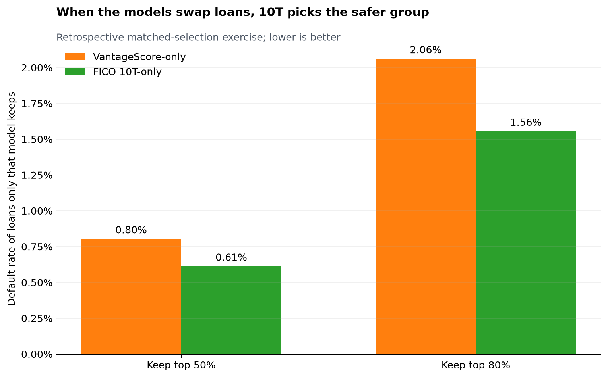

**What it shows:** The same disagreement in rate form at the 50% and 80% portfolio marks.

**What to notice:** The VantageScore-only group defaults more often at both points: 0.80% versus
0.61% at 50%, and 2.06% versus 1.56% at 80%. This is a retrospective comparison of originated
loans, not a study of approvals.

### 10. Where do the two modern scores disagree?

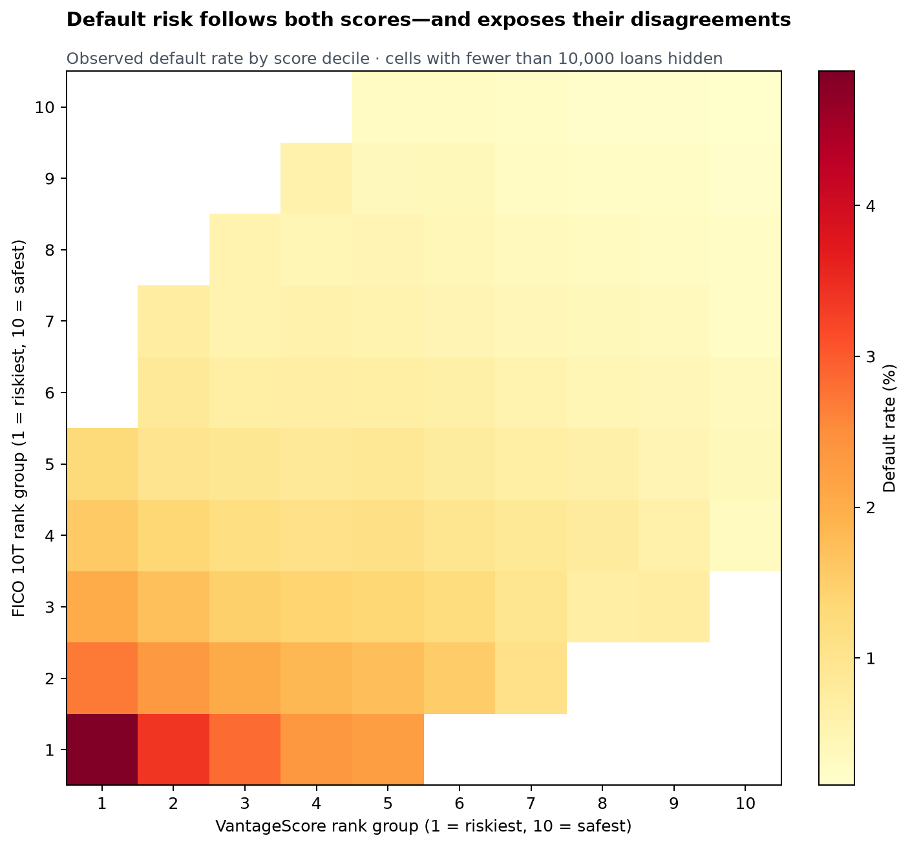

**What it shows:** Every loan is placed into a risk-ranked tenth under VantageScore and under 10T.
The color records the observed 36-month default rate for that pair of rankings.

**What to notice:** The darkest area is where both models say risky, and the lightest is where both
say safe. The off-diagonal cells are the disagreements. Cells with fewer than 10,000 loans are
hidden so tiny groups do not control the color scale.

### 11. What does the usual summary statistic say?

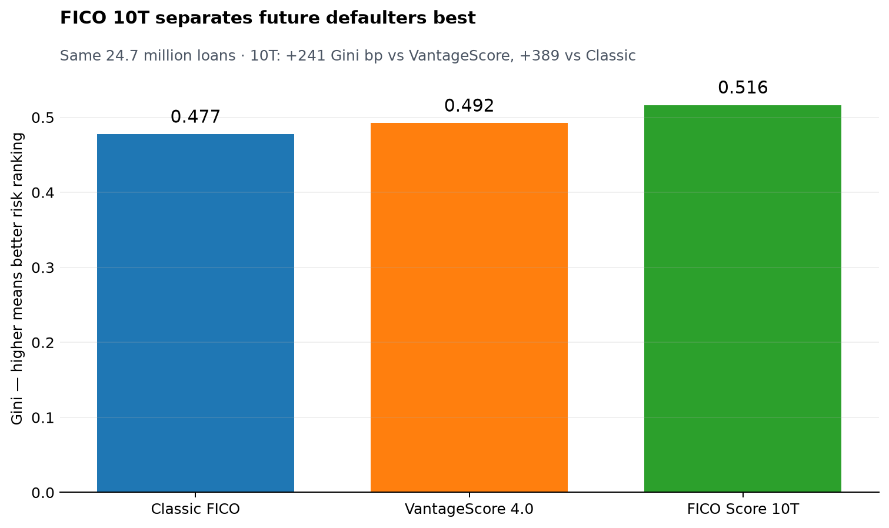

**What it shows:** Gini compresses the full risk ranking into one number. Zero represents random
ordering; a higher value means clearer separation between loans that default and loans that do
not.

**What to notice:** The technical summary agrees with the visible counts: 10T is highest at 0.516,
VantageScore is next at 0.492, and Classic FICO is 0.477. This is a cross-check, not a prerequisite
for understanding the result.

## The original pictures

Part 1 includes the earlier Classic-FICO-versus-VantageScore views: score-band transitions,
calibration bands, COVID-era heatmaps, and segment cuts. They remain in the
[Part 1 gallery](PART1_GALLERY.md).
