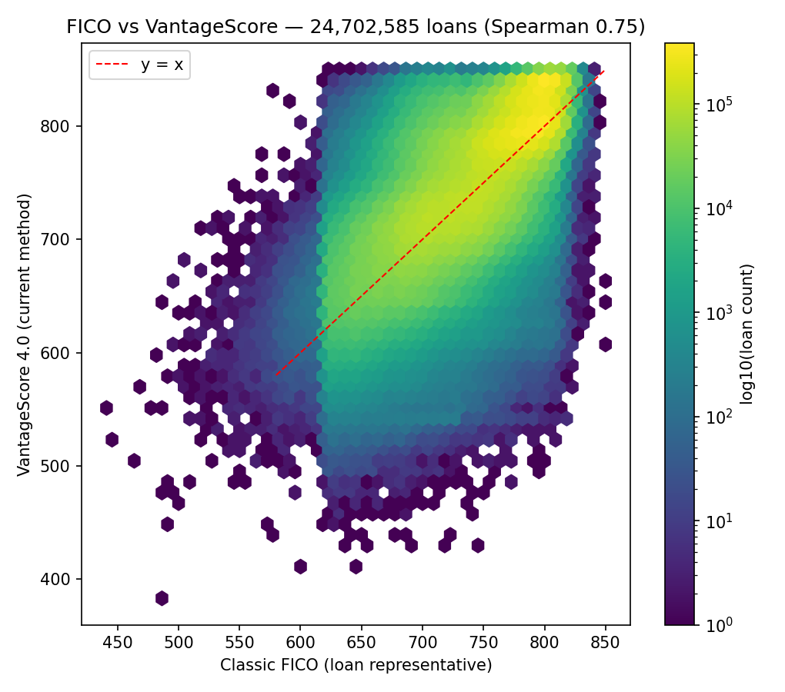
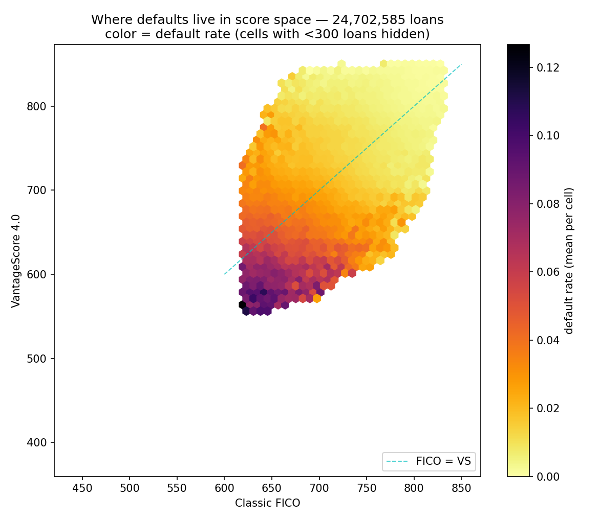
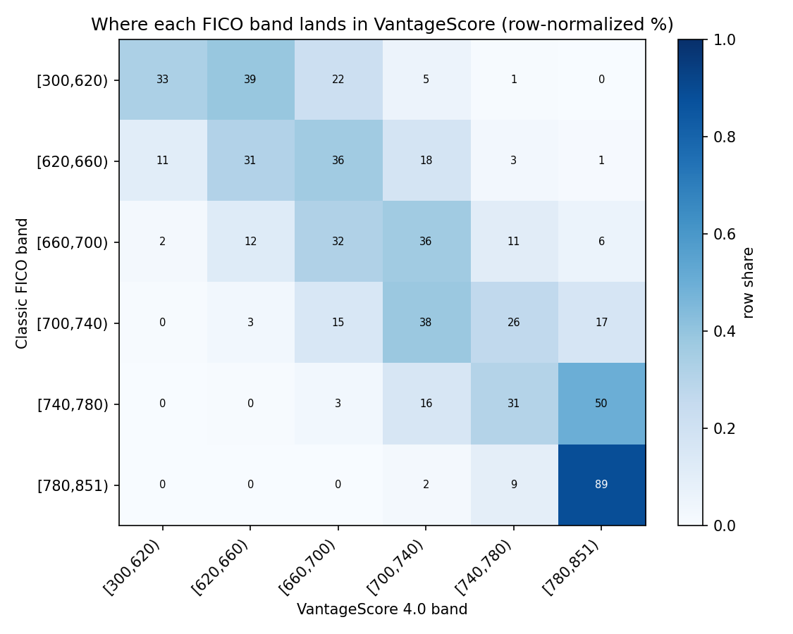
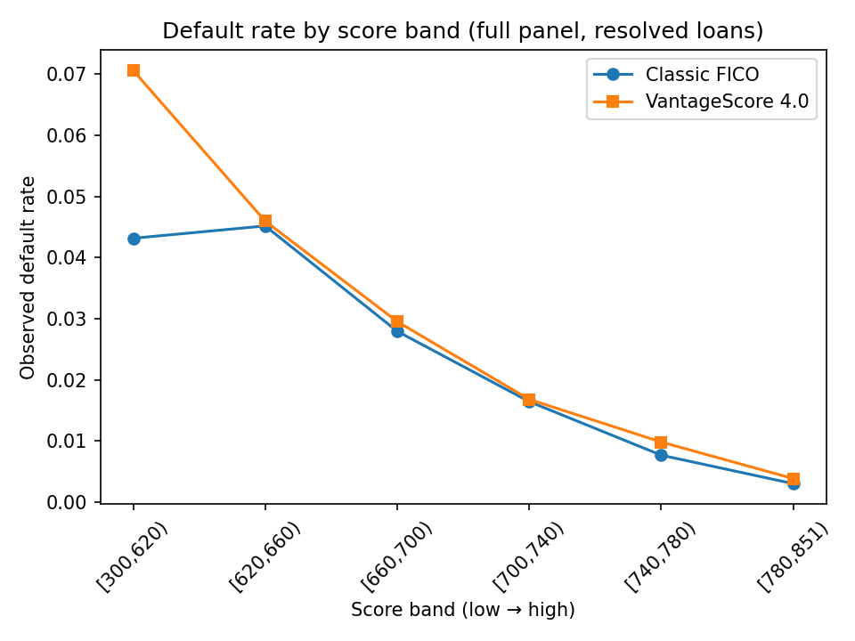
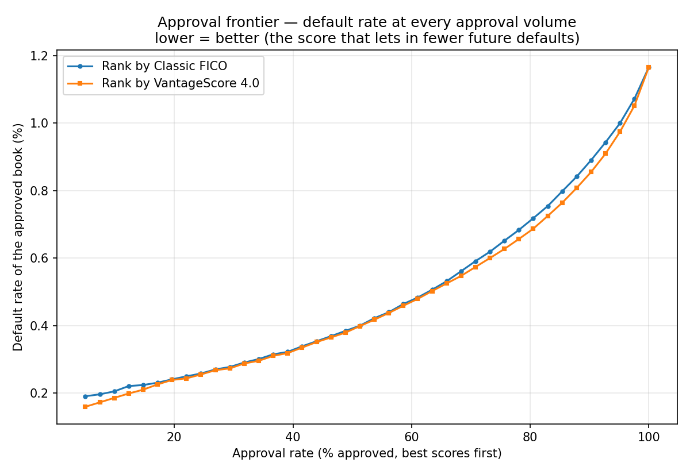
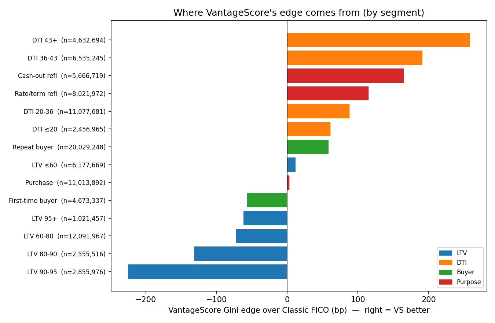
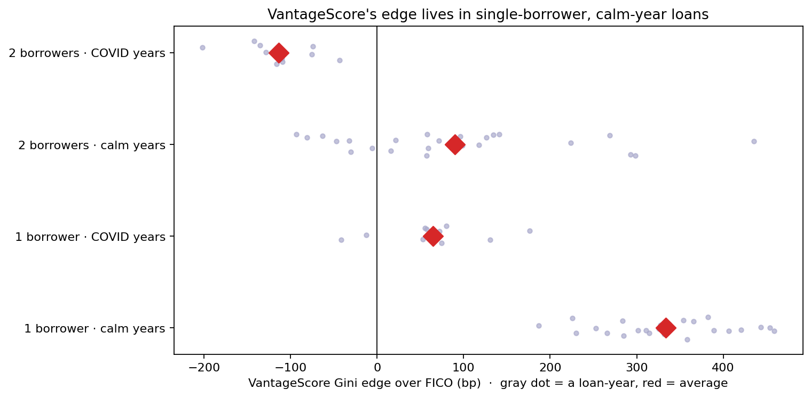
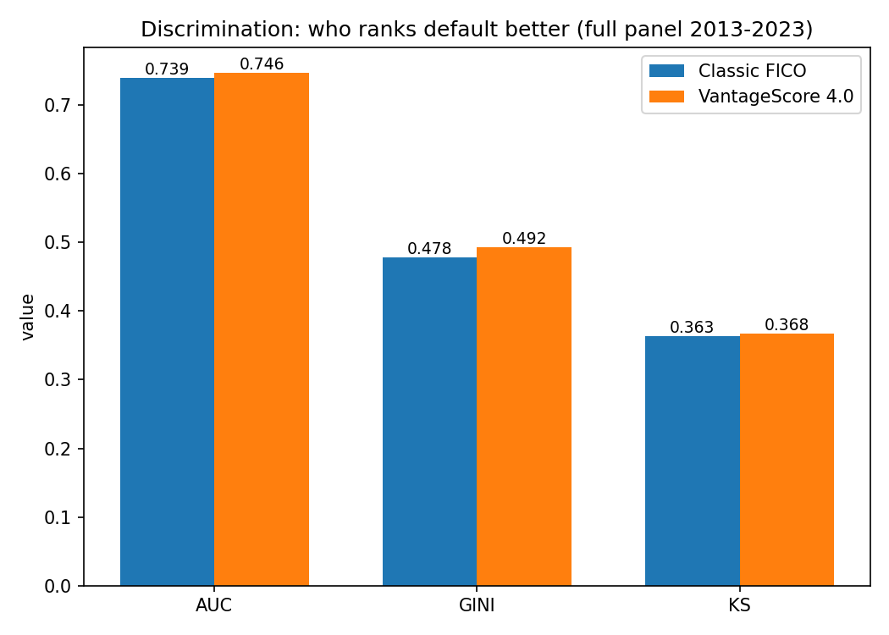
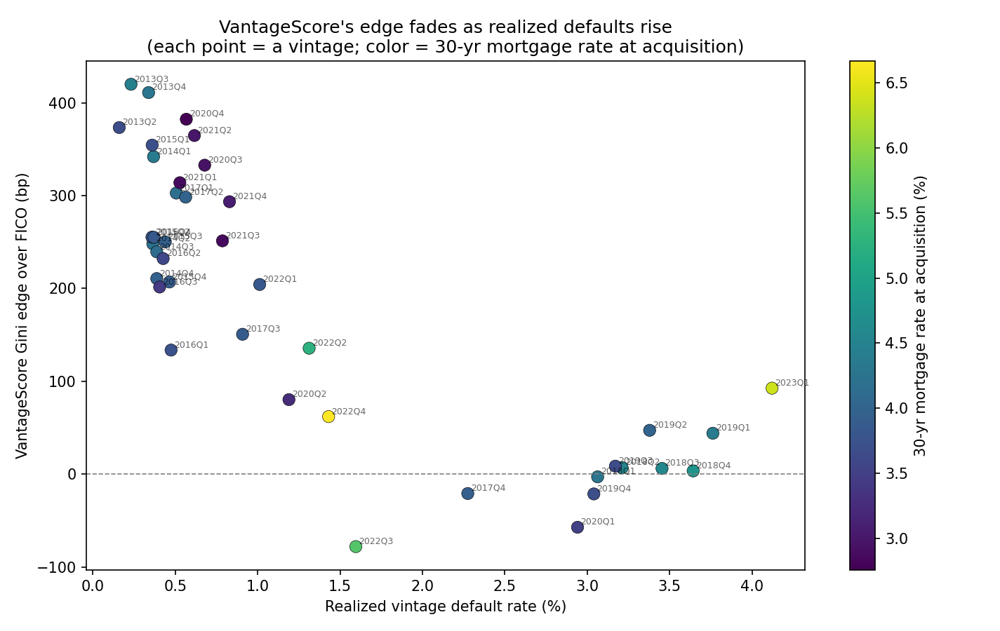

# More charts

Extra views from the same analysis. The writeup is in [README](README.md); the methods and exact numbers are in [REPORT](REPORT.md).

## FICO vs VantageScore, all 25 million loans

Each cell counts loans. The two scores agree along the bright diagonal and disagree across the spread. FICO stops at 620, the old acquisition floor; VantageScore runs lower.

## Where default lives in score space

Default rate across the FICO by VantageScore grid. Risk rises toward the bottom-left, where both scores are low.

## The same grid, calm years vs the COVID cohorts

In the high-default (COVID) loans, the dark zone spreads up and to the right into higher scores. The two panels show raw default rates on very different base rates, so read it as where risk concentrates, not as exact levels.

## Where each FICO band lands in VantageScore

Most loans sit near the diagonal. The off-diagonal mass is where the two scores disagree.

## Default rate by score band

Both scores fall steadily as the score rises. VantageScore extends below FICO's 620 floor, and that sub-620 group is its highest-default bucket.

## Default rate at every approval rate

If a lender took the best-scoring X% of applicants, this is the default rate of the loans they would take. Ranking by VantageScore gives a slightly lower-default book at most volumes.

## Where VantageScore's edge comes from

By borrower segment. The edge is larger on high-DTI loans and refinances, and negative on high-LTV loans and first-time buyers, where FICO does better. These are pooled across years, so some of the pattern is vintage mix rather than the segment itself.

## The edge as a distribution, by borrower count and year

Each gray dot is one loan-year; the red diamond is the average. The edge is big for single-borrower loans in calm years, and goes negative for two-borrower loans in the COVID years — so the average for two-borrower loans nets to roughly zero.

## The comparator matters

VantageScore has several scoring methods. Only the lowest-of-borrowers method is a fair match to representative FICO, and it shows the +148bp edge. The average-based methods look larger but aren't comparing like with like.

## Overall scores

AUC, Gini, and KS are three standard measures of how well a score separates defaulters from everyone else. VantageScore edges FICO on all three, by a little.

## The edge fades as defaults rise

Each dot is one loan-year. VantageScore's lead is largest in low-default years and near zero in high-default ones.
