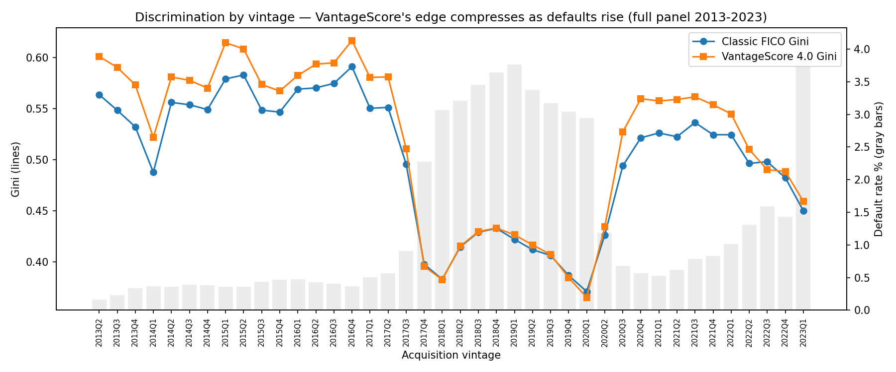
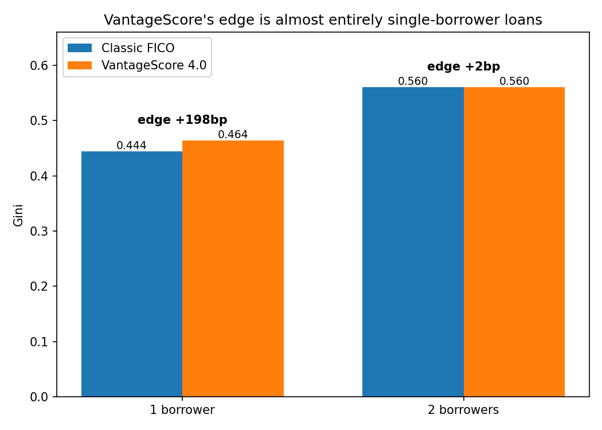
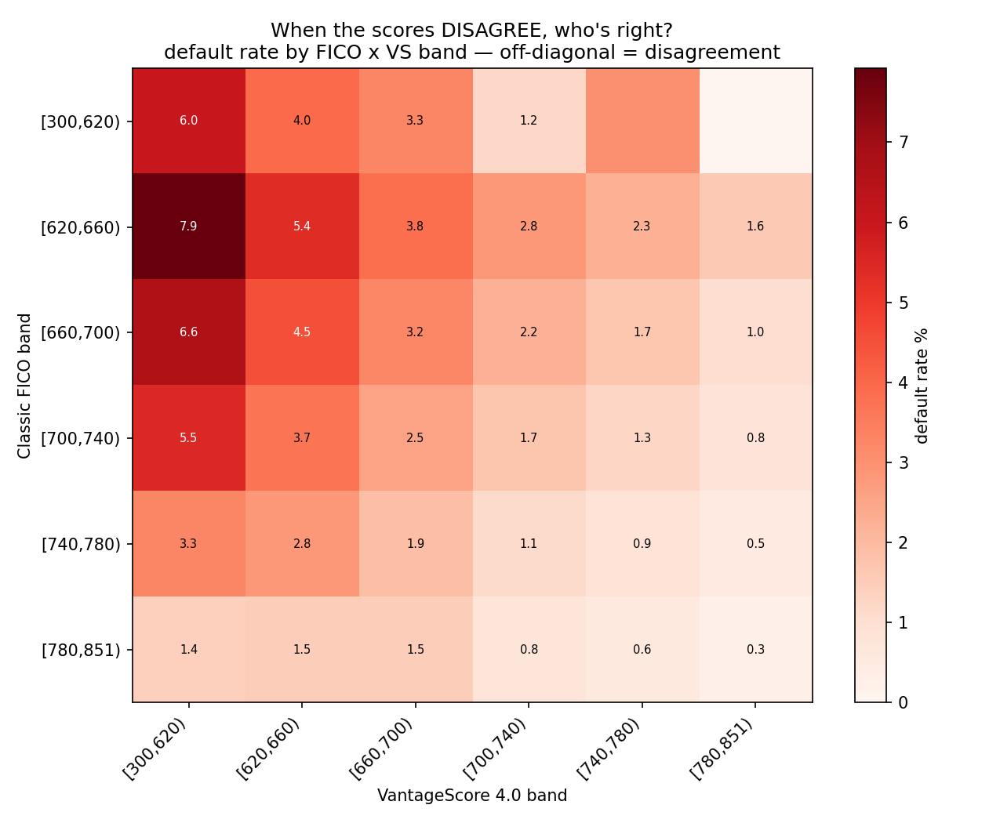
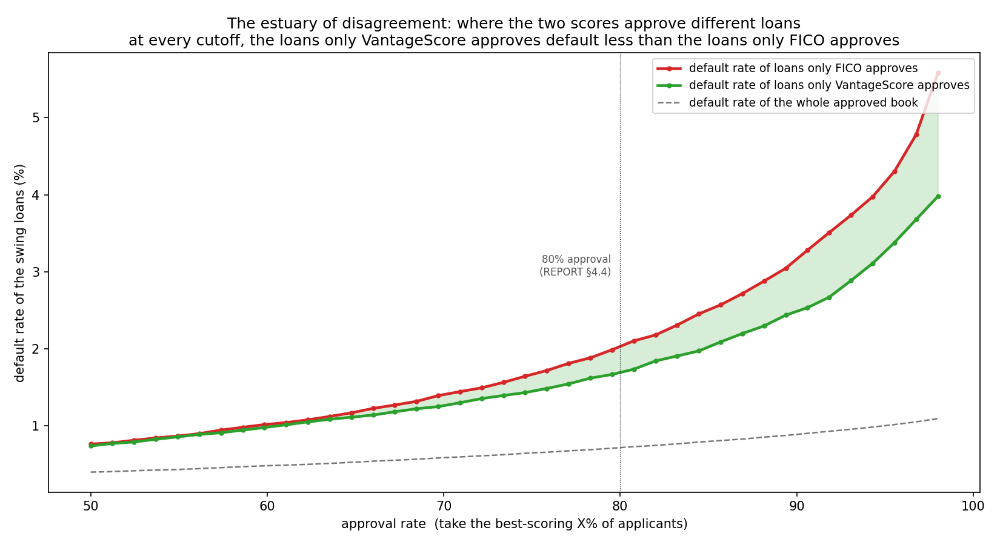

# Part 1 — Does VantageScore 4.0 beat Classic FICO?

> **Archived original study.** The 2026 three-score answer is now in the main [README](README.md),
> with methods in [REPORT](REPORT.md) and charts in [GALLERY](GALLERY.md). The text below preserves
> the original Classic-FICO-versus-VantageScore story.

For two decades, getting a Fannie Mae or Freddie Mac mortgage meant being graded by one company: FICO. No rival was allowed, and in the last few years FICO raised the price of its mortgage score sharply, because lenders had nowhere else to go. Regulators have now approved a competitor, VantageScore 4.0, and in July 2024 the data to test it went public for the first time. So I ran the test.

I took 24.7 million mortgages Fannie Mae bought between 2013 and 2023. Each one carries both a Classic FICO score and a VantageScore 4.0, and each has a resolved default outcome. The question is simple: which score better predicts who defaults?

To compare them, rank borrowers by each score and see where the defaulters land. A score that works puts them near the bottom. I measured that overall, then split the loans by the year they were made and by number of borrowers.

Across the whole set, VantageScore comes out a little ahead of Classic FICO. But that lead depends on the year the loan was made. In years with few defaults, VantageScore sorted risk better; in the high-default years the two were even. Those high-default loans were mostly made between 2018 and early 2020, and 93% of their defaults landed in 2020 and 2021. When the pandemic hit, defaults jumped across every score level at once, so where a borrower ranked mattered less. Read it as a COVID-period result; the data don't show how the scores hold up in other downturns.

Split the loans by how many people are on them, and almost all of VantageScore's edge comes from single-borrower loans. On two-borrower loans the scores tie, and both do better than they do on solo borrowers.

The two scores often disagree about the same person, and when they do, the default outcome tracks VantageScore a bit more than FICO. The sharpest example: borrowers FICO rates top-tier but VantageScore flags as risky default about five times as often as borrowers both scores rate highly.

Say a lender ranked these same loans by each score and kept the best-scoring share. The two scores pick slightly different loans, and at every cutoff the ones only VantageScore keeps default less than the ones only FICO keeps. At a four-in-five rate it's 1.7% versus 2.0%; tighten the cutoff and the gap widens.

What this Part 1 comparison didn't settle: the FICO here is Classic FICO, the old model. FICO 10T is the real head-to-head, and its historical data was released in July 2026. **[Part 2 runs that comparison](PART2.md)** and finds 10T ahead of both VantageScore 4.0 and Classic FICO. These are still only the loans Fannie actually bought, so they say nothing about borrowers turned down before a loan existed, or about pricing, or about how lenders would really use the scores. And the only stretch of real stress in the data is COVID, so that part of the result rests on a single episode.

On the loans I can see, VantageScore 4.0 is about as good as Classic FICO, and a bit better in the cases above. That weakens the claim that FICO can't be replaced, but it doesn't make VantageScore the clear winner: the edge is small, and whether it shows up at all depends on which borrowers and which years you look at.

Numbers, methods, and code are in the [Part 1 report](PART1_REPORT.md). More charts are in the
[Part 1 gallery](PART1_GALLERY.md).
