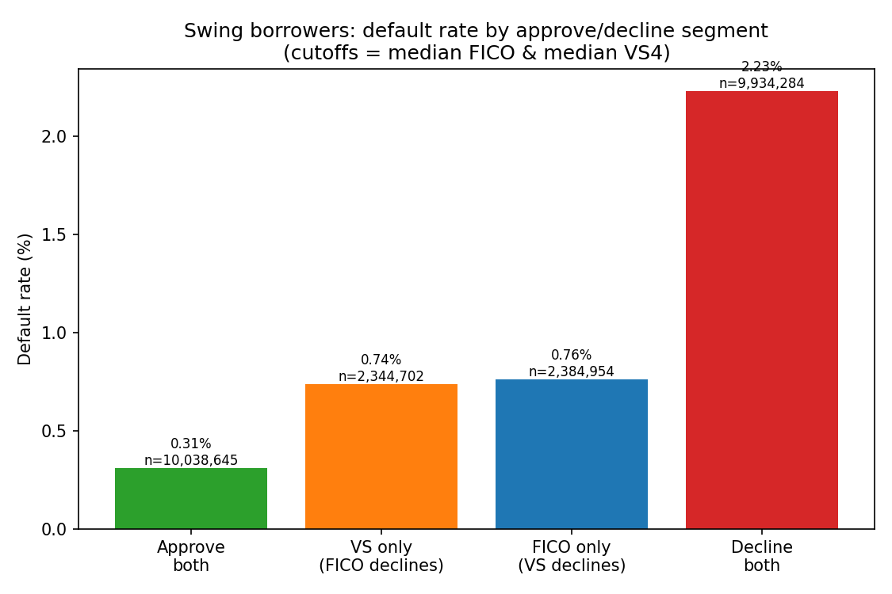

# Classic FICO vs. VantageScore 4.0 — a loan-level default-prediction bake-off

*Which mortgage credit score actually predicts default better, on the same loans — and are they substitutable?*

> ⚠️ **Scope — read this first.** This study compares **modern VantageScore 4.0** against **Classic (legacy) FICO** — **not FICO Score 10T.** Classic FICO is the only FICO score in the public GSE loan-performance data today. The like-for-like **FICO 10T vs VantageScore 4.0** comparison requires the FICO 10T historical data the GSEs have announced for **summer 2026** (not yet released). Until that drops, every result here is **VantageScore 4.0 (current method) vs Classic FICO.**

> **Status:** Full panel complete — **2013Q2–2023Q1, 24.7M loans, 99.98% join**. Results below. (Classic FICO vs VantageScore 4.0; see scope caveat above.)

## Abstract
- Head-to-head test of **Classic FICO** vs **VantageScore 4.0** as default predictors on the *same* Fannie Mae mortgages, using the first public loan-level VantageScore data (released 2024).
- Goal: turn the long-running "FICO vs VantageScore" debate from an argument into a measurement — discrimination, agreement, and marginal-borrower behavior.
- Motivated by the GSEs' move to accept VantageScore 4.0 / FICO 10T, which puts FICO's decades-long sole-score position (and pricing power) in play.

## Introduction
- FHFA validated FICO 10T and VantageScore 4.0 for the GSEs (2022); adoption is phased — VantageScore 4.0 is in (limited) rollout, while FICO 10T is approved with historical 10T scores expected Summer 2026. A substitute score is only adoptable if it underwrites at least as well.
- The 2024 public release of loan-level VantageScore 4.0 scores (joinable to the existing loan-performance data) makes an independent, outcome-based comparison possible for the first time.
- Question this repo answers: **is VantageScore 4.0 a genuine substitute for Classic FICO in mortgage credit risk, and for which borrowers do they disagree?**

## Data
- Fannie Mae **Single-Family Loan Performance** dataset (origination attributes + monthly performance) joined to the **VantageScore 4.0 Historical Scores** file.
- Acquisition quarters **2013Q2–2023Q1** (the VantageScore-overlap window); ~25M loans in the score file; loan-level join on `loan_identifier + acquisition_quarter`.
- Each loan carries **both** scores (Classic FICO + VantageScore 4.0) and a realized default outcome. Public, anonymized, free (registration required).

## Methods
- **Default** = ever-180-days-delinquent or credit-event termination within a 36-month window from origination; voluntary prepayment treated as a competing risk (known non-default), not censoring.
- **Comparator scores:** VantageScore `vs4_current_method` vs the Classic FICO **loan representative score** = min(borrower, co-borrower), matching the lowest-of-borrowers methodology.
- **Discrimination:** AUC / Gini / KS, overall and **per vintage** (stress-vintage robustness). Immature (unresolved) loans excluded; results are **conditional on GSE acquisition** (FICO floored ~620), not unconditional.
- **Agreement & marginal analysis:** rank correlation, score-band transition matrix, and a **matched-approval-rate** swing-borrower test (who each score uniquely approves, and how those loans perform).

## Results
*(24.7M loans, resolved & ≤2-borrower, conditional on GSE acquisition / FICO ≥ 620; default = D180+ or credit event within 36 months)*

- **Overall, VantageScore 4.0 edges Classic FICO** on every discrimination metric: **Gini 0.492 vs 0.478 (+148 bp)**, AUC 0.746 vs 0.739, KS 0.368 vs 0.363.

  

- **But the edge is vintage-dependent — and that is the finding.** It is large in **low-default** vintages (+200 to +420 bp; 2013–2017, 2020–2021) and **compresses to ≈ zero in high-default vintages** (2017Q4–2020Q1, defaults 2.3–3.8%), where FICO is occasionally ahead. VantageScore's advantage concentrates in benign cohorts and fades exactly when credit deteriorates.

  

- **The two scores are correlated but not interchangeable** — Spearman **0.75**, with large band-to-band reshuffling.
- **Marginal (swing) borrowers:** at a matched **80% approval rate**, the loans VantageScore uniquely approves default **1.72% vs 2.05%** for FICO-unique approvals — VantageScore expands access **~16% more safely** at the inclusive margin.

  

- **Below the floor:** GSE underwriting floors FICO at ~620; VantageScore scores a tail of borrowers below it, isolating measurable risk FICO cannot express.
- *Caveat:* recent vintages (2022Q3–2023Q1) have small resolved samples (36-month seasoning incomplete) and are noisy.

## Conclusion
- **VantageScore 4.0 is a strong, frequently-superior substitute for Classic FICO in normal conditions — but no better under stress.** When defaults rise, the two rank-order default about equally.
- For the credit-score-competition / FICO pricing-power debate, this cuts **both** ways: it undercuts *"FICO is irreplaceable"* (VantageScore matches or beats it most of the time) **and** *"VantageScore is strictly better"* (its edge evaporates precisely when discrimination matters most).
- **Forward look:** this is **Classic FICO, not FICO 10T.** The like-for-like **FICO 10T vs VantageScore 4.0** comparison unlocks with the **summer-2026** data release — the decisive follow-up.

---

## Reproducing

```bash
python3 -m venv .venv && ./.venv/bin/pip install -r requirements.txt
./.venv/bin/python -m pytest -q          # unit-tested label/metrics/join engine
```

1. **Get the data** (free, registration): the VantageScore 4.0 Historical Scores for the Historical Loan Performance Dataset (`historicalcreditscores.fanniemae.com`) and the Single-Family Loan Performance quarterly files (`datadynamics.fanniemae.com`).
2. **Smoke (one quarter):** place a quarter's files, then:
   ```bash
   export GSE_MODE=smoke
   for s in 02_load 04_label 03_join 05_compare; do ./.venv/bin/python "$s.py"; done
   ```
3. **Full panel** (disk-safe, quarter-by-quarter):
   ```bash
   unset GSE_MODE
   for s in run_full 03_join 05_compare 06_charts; do ./.venv/bin/python "$s.py"; done
   ```

- `config.py` holds all parameters (default definition, window, score variant, column map). `gse/` is the unit-tested core; `0X_*.py` are the pipeline stages. Data lives under `data/` (git-ignored).

## References
- FHFA, *Validation of FICO 10T and VantageScore 4.0* (2022); *Historical VantageScore 4.0 release* (Jul 2024); *FICO 10T historical data + extended VantageScore* announcement (Apr 2026).
- Fannie Mae, *Single-Family Loan Performance Dataset* and *Historical Credit Score Files* (Credit Score Models and Reports Initiative).
