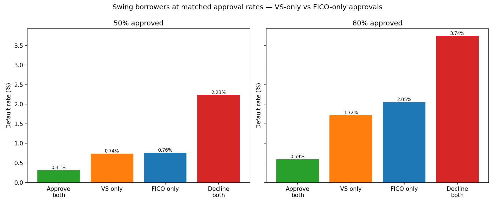
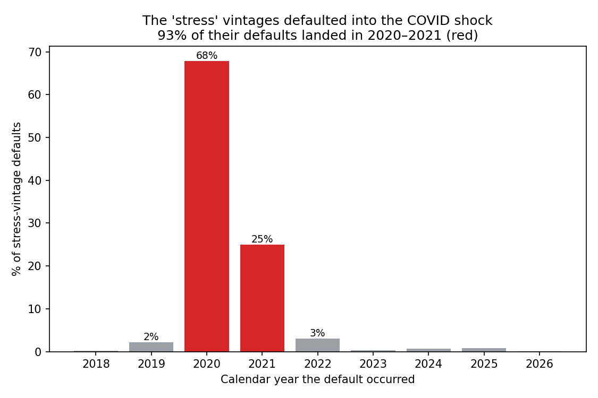
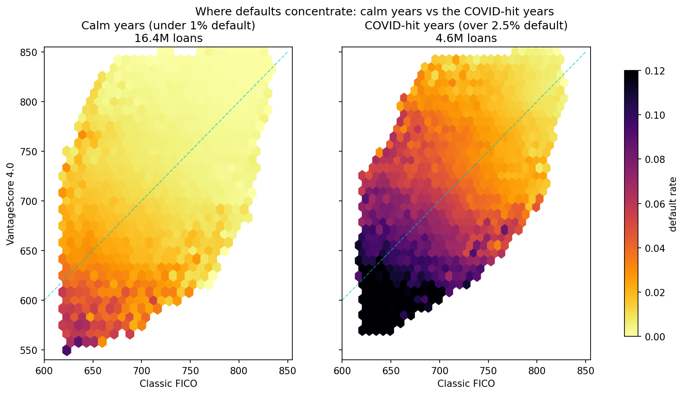
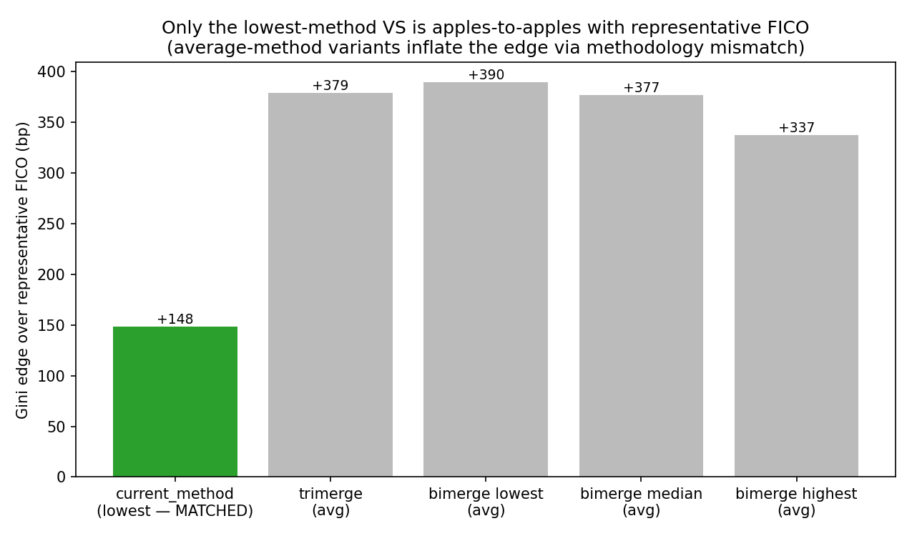

# Classic FICO vs. VantageScore 4.0 — a loan-level default-prediction bake-off

*On 24.7M Fannie Mae mortgages with both scores attached, which one actually predicts default better — and for whom?*

> ⚠️ **Scope — read this first.** This compares **modern VantageScore 4.0** against **Classic (legacy) FICO** — **not FICO Score 10T.** Classic FICO is the only FICO in the public GSE loan-performance data today. The like-for-like **FICO 10T vs VantageScore 4.0** comparison needs the FICO 10T historical data the GSEs have announced for **Summer 2026** (not yet released). Every result here is **VantageScore 4.0 (current/lowest method) vs Classic FICO**, on **Fannie-acquired** loans only.

## Abstract
- Head-to-head test of **Classic FICO** vs **VantageScore 4.0** as default predictors on the *same* Fannie Mae mortgages, using the first public loan-level VantageScore data (released July 2024).
- **VantageScore wins on average, but the average hides the story.** Pooled Gini edge is +148bp (0.492 vs 0.478); weighting by where defaults actually occur, it is **+100bp**, and it splits sharply by regime and by borrower count.
- **The edge is regime-conditional:** ~**+294bp in benign vintages**, ~**+2bp (zero) in the high-default cohorts** — and those cohorts are the ones whose defaults landed in the **2020–21 COVID shock**, so this is evidence about one correlated macro event, not a general "stress" law.
- **The edge is almost entirely single-borrower loans:** **+198bp on 1-borrower loans, +2bp on 2-borrower loans** (where the scores are tied and both much stronger).
- When the two disagree, the outcome tracks VantageScore *modestly* more than FICO (residual Gini 0.242 vs 0.218).
- **Bottom line:** VantageScore 4.0 is a real, often-better substitute for Classic FICO in normal conditions and on single-borrower loans — and no better under the COVID shock or on co-borrower loans. Directionally relevant to the credit-score-competition debate; it does **not** settle pricing-power or FICO-10T questions.

## 1. Introduction
- FHFA validated FICO 10T and VantageScore 4.0 for the GSEs (Oct 2022); adoption is **phased** — VantageScore 4.0 is in a limited approved-lender rollout (2026), while FICO 10T is approved with historical 10T scores expected **Summer 2026**. A substitute score is only adoptable if it underwrites at least as well.
- The **July 2024** public release of loan-level VantageScore 4.0 (joinable to the existing loan-performance data) makes an independent, outcome-based comparison possible for the first time.
- Question: **on Fannie-acquired mortgages, is VantageScore 4.0 a genuine substitute for Classic FICO in default discrimination, and for which loans do they diverge?**

## 2. Data
- Fannie Mae **Single-Family Loan Performance** dataset (origination attributes + monthly performance) joined to the public **VantageScore 4.0 Historical Scores** file on `loan_identifier + acquisition_quarter`. Acquisition quarters **2013Q2–2023Q1** (the VantageScore-overlap window).
- **Full joined panel: 25,087,678 loans, 99.98% score-match** (25,081,784 matched). 11,767 rows (0.05%) are missing **at least one** score (3,480 missing both).
- **Headline analysis sample: 24,702,585 loans** — those with **both** scores, a resolved 36-month outcome, and ≤2 borrowers (see §3). Public, anonymized, free (registration required).

## 3. Methods
- **Default** = ever-180-days-delinquent OR a credit-event zero-balance code (`02/03/09/15`) within a 36-month window from origination; **voluntary prepayment is treated as a known non-default** (we report a binary "default within window" label, not a formal competing-risks model — see Limitations).
- **Comparator scores.** VantageScore **`vs4_current_method`** (lowest-of-borrowers) vs the Classic FICO **loan representative score = min(borrower, co-borrower)** — both lowest-method, so they are **apples-to-apples**. VantageScore's *average*-method variants score +337–390bp, but that is a methodology mismatch against lowest-method FICO, not a larger true edge (§4.6).
- **Discrimination:** AUC / Gini / KS. We report **pooled, within-vintage (loan- and default-weighted), and by-regime** figures, because pooled numbers mix vintages of very different base rates.
- **Conditioning & exclusions.** Results are conditional on **Fannie acquisition** (the headline sample sits overwhelmingly above the historical ~620 acquisition floor; 5,957 of its loans are below it). Immature loans (observed <36 months, no event, not prepaid) are excluded; prepaid loans are kept as known non-defaults. Loans with >2 borrowers are excluded from the headline because the Classic FICO comparator only carries borrower + co-borrower.

## 4. Results
*(headline sample: 24.7M resolved, ≤2-borrower, both-score, Fannie-acquired loans. Overall AUC: FICO 0.739, VS 0.746; KS 0.363 vs 0.368; Gini 0.478 vs 0.492.)*

### 4.1 The average wins for VantageScore, but it is regime-conditional
Pooled Gini edge **+148bp**; within-vintage **+210bp loan-weighted**, **+100bp default-weighted**. The split: **+294bp in benign vintages (default <1%) vs +2bp in stress vintages (default >2.5%)**. The edge concentrates where defaults are rare and collapses where they are common.


### 4.2 The edge is almost entirely single-borrower loans
**+198bp on 1-borrower loans (Gini 0.464 vs 0.444); +2bp on 2-borrower loans (0.560 vs 0.560).** On co-borrower loans the two scores are tied — and both are markedly stronger, because the lowest-of-two aggregation already captures most of the signal.


### 4.3 When they disagree, VantageScore is modestly "more right"
Holding FICO fixed, default still falls sharply as VantageScore rises (and vice-versa, less so): residual Gini is **0.242 for VS within fixed FICO bands vs 0.218 for FICO within fixed VS bands.** Concretely, borrowers FICO rates super-prime (780+) but VantageScore rates subprime (<620) default ~**1.4%**, ~5× the true-super-prime rate.


### 4.4 Marginal (swing) borrowers, at matched approval
At a **matched 80% approval rate**, the loans VantageScore uniquely approves default **1.72%** vs **2.05%** for the loans FICO uniquely approves — a **16.3% relative (33.4bp absolute)** lower bad rate. (This is a *quality* difference at ~matched volume — within 0.1pp; **not** an access expansion, since VantageScore's unique-approval count is actually slightly lower. Controlling for vintage shrinks the gap to ~11%.)



### 4.5 The "stress" compression is the COVID shock — not a general law
The high-default vintages where the edge vanishes (default >2.5%; chiefly 2018–2020Q1 originations) had **93% of their defaults occur in calendar 2020–2021** (68% in 2020 alone). So "the edge disappears under stress" is more precisely "the edge disappears in the COVID shock" — a single correlated event that hit borrowers across the score distribution at once (and whose D180 marks may partly reflect forbearance mechanics). Read it as evidence about one shock, not a general stress regime.



The same point is visible at the loan level in score space: in calm years the default risk sits in the bottom-left corner (both scores low), but in the COVID-hit years the high-default zone spreads up and to the right into higher-score borrowers. A shock that lifts default across the whole score range is exactly what flattens each score's ranking power.



### 4.6 Comparator discipline
Only the **lowest-method** VantageScore is comparable to representative (lowest-method) FICO. The average-method variants post +337–390bp edges, but averaging across bureaus/borrowers mechanically reduces noise relative to a lowest-method FICO; using them would overstate the result.



## 5. Conclusion
- On Fannie-acquired mortgages, **VantageScore 4.0 is a real and frequently-better substitute for Classic FICO** — but the advantage is **concentrated in benign conditions and single-borrower loans**, and is **absent under the COVID shock and on co-borrower loans.**
- For the credit-score-competition debate this cuts both ways: it undercuts a strong "FICO is irreplaceable" claim (VantageScore matches or beats Classic FICO in most cells) **and** a strong "VantageScore is strictly better" claim (no edge where it would matter most, and only on single-borrower loans).
- **Out of scope:** this tests Classic FICO (not FICO 10T), Fannie-acquired loans (not applicants denied at origination, not Freddie separately, not post-2025 policy), and discrimination only (not pricing, lender operations, or adverse selection under lender score choice).

## Limitations / ways this is wrong
- **Classic FICO, not FICO 10T.** The policy-relevant modern comparison waits on the Summer-2026 10T data.
- **COVID confound.** The stress-regime result is one macro event; COVID-era D180 may partly reflect forbearance, not pure credit deterioration.
- **Binary label, not competing risks.** Prepayment is kept as a known non-default within a fixed 36-month window rather than modeled as a competing risk; alternative windows/definitions could move magnitudes.
- **Restricted range & selection.** Evaluated only on already-acquired GSE loans (overwhelmingly ≥620), so absolute AUCs understate full-population discrimination, and segment cuts (e.g., LTV) are partly vintage-mix artifacts.
- **Comparator method.** Results use lowest-method VantageScore; the legally/operationally "official" comparator method, if different, would change magnitudes.

## Reproducing

```bash
python3 -m venv .venv && ./.venv/bin/pip install -r requirements.txt
./.venv/bin/python -m pytest -q          # unit-tested label/metrics/join engine
```

1. **Get the data** (free, registration): VantageScore 4.0 Historical Scores for the Historical Loan Performance Dataset (`historicalcreditscores.fanniemae.com`) and the Single-Family Loan Performance quarterly files (`datadynamics.fanniemae.com`).
2. **Smoke (one quarter):**
   ```bash
   export GSE_MODE=smoke
   for s in 02_load 04_label 03_join 05_compare; do ./.venv/bin/python "$s.py"; done
   ```
3. **Full panel** (disk-safe, quarter-by-quarter) + analyses:
   ```bash
   unset GSE_MODE
   for s in run_full 03_join 05_compare 06_charts 07_deepdive 08_loanlevel_heatmap 09_gate 10_report_charts; do ./.venv/bin/python "$s.py"; done
   ```

- `config.py` holds all parameters; `gse/` is the unit-tested core; `0X_*.py` are the pipeline + analysis stages. Data lives under `data/` (git-ignored).

## References
- FHFA, *Validation of FICO 10T and VantageScore 4.0* (Oct 2022); *Release of historical VantageScore 4.0 scores* (Jul 2024); *Credit Scores* policy page (FICO 10T historical data expected Summer 2026); Fannie Mae & Freddie Mac VantageScore 4.0 rollout announcements (Apr 2026).
- Fannie Mae, *Single-Family Loan Performance Dataset* and *Historical Credit Score Files* (Credit Score Models and Reports Initiative).
